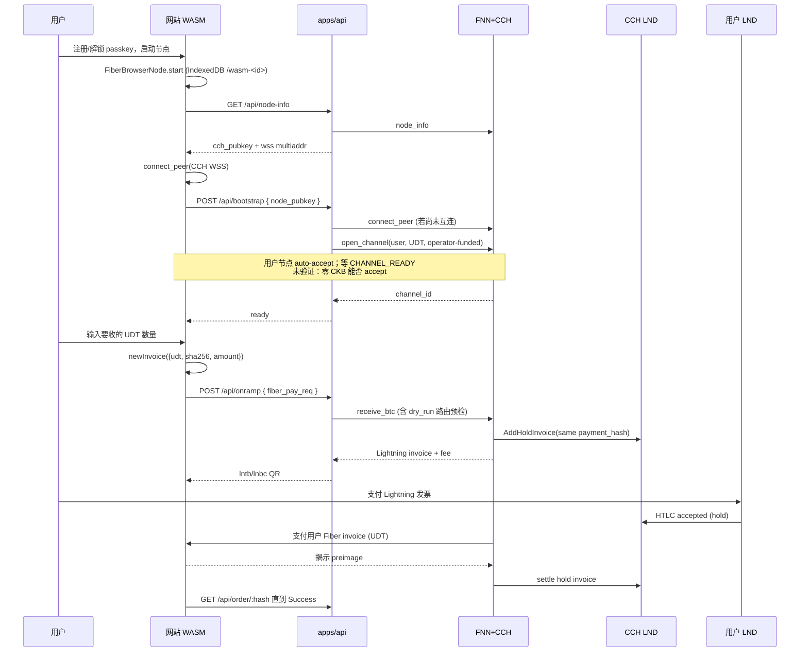

# CKB On-Ramp 架构调研

> Spike 范围：参考 [humble-little-bear/fiber-swap-demo](https://github.com/humble-little-bear/fiber-swap-demo)，对照 Fiber CCH `receive_btc`、浏览器 WASM Fiber 节点、用户侧 LND 支付，给本空仓库提出可运行骨架。
>
> 证据截止：Fiber `v0.9.0` / `v0.9.1` 源码、`@fiber-pay/react@0.3.2`、`@fiber-pay/sdk@0.3.2`、fiber-swap-demo `main`（clone 于本 spike）。未在本 worktree 跑通 E2E；凡未实测处标 **未验证**。

> 实现注记（2026-09-17）：本 spike 完成后，仓库已加入 npm workspace、Vite/React web、Express API、共享 DTO、mock CCH adapter 与真实 RPC adapter。当前可运行的是 mock vertical slice；真实 `bootstrap` 在 `CCH_MODE=rpc` 下会明确返回 `501`，直到第 6 节的通道 PoC 通过。实现版本锁为 `fiber-js@0.9.0`、Vite 7.3.6 与 npm workspace；下文目录/版本建议保留为调研时证据，不代表当前 package manifest。

---

## 1. 调研结论与采纳建议

**核心结论：【有条件采纳】**

不要把 fiber-swap-demo 当产品脚手架整仓复制。它验证了 **BTC Lightning → Fiber UDT** 这条协议链路，但产品假设完全相反：

| | fiber-swap-demo | 本产品 ckb-on-ramp |
|---|---|---|
| 用户已有 | CKB 测试币、cWBTC、浏览器节点、通道 | **只有 LND + BTC** |
| 主路径 | 双向 swap，默认 `ckb-to-btc` | 单向入金 `btc-to-ckb`（CCH `receive_btc`） |
| 浏览器节点角色 | 付款方（付 cWBTC） | 收款方（收 UDT） |
| 第一笔资产 | faucet 发 UDT | **这就是产品本身** |
| 后端 LND | 另挂一台 receiver LND 造演示发票 | **不需要**。CCH 自己的 LND 出 hold invoice |

**推荐方案：** 网站内嵌浏览器 WASM Fiber 节点 + 应用后端只暴露 CCH 的 `receive_btc` / `get_cch_order` + **运营方 LSP 入向通道 bootstrap**。用户用自己的 LND 付返回的 BOLT11，原子换成 CCH 配置的 wrapped-BTC UDT。

**核心理由**

1. CCH `receive_btc` 已在 Fiber v0.9.0 实现，且 demo 的 `POST /api/swap/btc-to-ckb` 已跑通测试网（HANDOFF：2026-07-14 验证过 100 sat）。
2. 原子性不靠信任运营方：同一 `payment_hash`（必须 `sha256`）锁住 LND hold invoice 与 Fiber invoice。CCH 拿不到 preimage 就无法 settle BTC；用户拿不到 UDT 就不会泄露 preimage。
3. **条件（不满足则不可上线）：** 创建 CCH 订单前，FNN 必须能对用户 Fiber invoice 做 `send_payment(dry_run=true)` 预检。零通道、零 CKB 的全新 WASM 节点 **过不了这一关**。demo 没做这件事，本产品必须把它做成主路径。

**明确不做**

- 反向 `send_btc` / 用户付 cWBTC。
- 给用户发 UDT faucet。
- 后端直连用户 LND（用户自己付发票）。
- 新写 CKB 链上合约（`packages/contracts` 只放前后端共享 DTO）。
- 任意 UDT 入金。CCH 只服务配置的 wrapped-BTC UDT（8 decimals）。第一笔资产就是这个 UDT，不是「任意 CKB 代币」。

---

## 2. 产品协议对齐（先钉死）

用户原话容易读成「用 LND 去付一张 Fiber 发票」。协议上 **LND 付的是 CCH 生成的 Lightning hold invoice**，不是 `fibt...` 本身。

```
用户 WASM 节点 new_invoice(udt, hash_algorithm=sha256)
        ↓ fiber_pay_req
后端 receive_btc(fiber_pay_req)
        ↓ CCH 用同一 payment_hash 在自己的 LND 上 AddHoldInvoice
用户 LND 支付返回的 lntb... / lnbc...
        ↓ IncomingAccepted
CCH Fiber 节点支付用户的 Fiber invoice（UDT）
        ↓ 用户节点揭示 preimage
CCH settle LND hold invoice
        ↓ Success
```

CCH 源码硬约束（`crates/fiber-lib/src/cch/actor.rs` `receive_btc`）：

1. Fiber invoice **必须带签**（`CkbInvoice::from_str`）。
2. `currency` 必须匹配 FNN 网络（testnet=`Fibt` / mainnet=`Fibb`）。
3. **必须有 amount**（amountless 直接拒）。
4. UDT type script **必须等于** CCH `wrapped_btc_type_script`。
5. `hash_algorithm` **必须是 `sha256`**，默认 `ckb_hash` 会被 LND 拒绝。
6. Fiber `final_tlc_minimum_expiry_delta` 必须 `< btc_final_tlc_expiry_delta_blocks * 600s / 2`。
7. **订单创建前** `call_payment_preflight`：对用户发票 `send_payment(dry_run=true)`。没有路由就 **不会** 创建 LND hold invoice。
8. LND hold invoice 金额 = Fiber 本金 + CCH fee（`base_fee_sats + amount * fee_rate / 1e6`）。

demo README 写过 rc7「同一 `fiber_pay_req` 非幂等」。v0.9.0 actor 对 **同一** `fiber_pay_req` 会返回已有订单；**失败后换新发票** 仍必须，因为 payment hash 已占用 LND hold invoice。以源码为准，不要抄 rc7 注释。

---

## 3. 参考项目逐文件：可复用 / 不可复用

根：https://github.com/humble-little-bear/fiber-swap-demo

### 3.1 直接复用（抄逻辑，改名改范围）

| 文件 | 作用 | 本仓库怎么用 |
|---|---|---|
| `packages/shared/src/invoice.ts` | BOLT11 / Fiber 发票形态判断、sats 解析 | `packages/shared` 原样搬。浏览器和 API 共用。 |
| `packages/shared/src/index.ts` | re-export | 原样 |
| `backend/src/services/fnnClient.ts` | FNN JSON-RPC + `FnnRpcError` | `apps/api/src/services/fnnClient.ts`。超时 10s 对 `receive_btc` 预检可能偏短，提到 60s。 |
| `backend/src/utils/cch.ts` | `{Fiber\|Lightning}` 发票拆箱 | 原样 |
| `backend/src/routes/swapReceive.ts` | `POST receive_btc` | 改名为 `POST /api/onramp`。核心契约不变。 |
| `backend/src/routes/order.ts` | `get_cch_order` | `GET /api/order/:payment_hash` |
| `backend/src/routes/quote.ts` | 与 FNN fee 公式对齐的报价 | 保留公式；env 必须与 FNN `cch.base_fee_sats` / `fee_rate_per_million_sats` 一致 |
| `backend/src/routes/health.ts` | FNN `node_info` 探活 | 原样 |
| `backend/src/routes/node.ts` | 公开 pubkey / peers | 加上 **WSS multiaddr**，浏览器要拿它去 `connect_peer` |
| `src/hooks/useQuote.ts` | 防抖报价 | 原样 |
| `src/hooks/useOrderStatus.ts` | 指数退避轮询到 Success/Failed | 原样 |
| `src/hooks/useSwap.ts` | 只留 `btc-to-ckb` 分支 | 改成 `useOnramp` |
| `src/api/client.ts` | fetch 封装 | 删 `postSwapCkbToBtc` / `postBtcInvoice` / faucet |
| `src/utils/cwbtc.ts` `format.ts` `invoice.ts` | 8 位小数、sats | 泛化为 `udt.ts`，名称可配置 |
| `src/context/FiberNodeProvider.tsx` | `useFiberNode` + UDT whitelist | 必须补：运营方 bootnode、`autoAcceptAmount`、**零 CKB auto-accept**（见 §6） |
| `src/context/FiberNodeContext.ts` 及两个 hook | Context | 原样 |
| `vite.config.ts` | COOP/COEP、fiber-js manualChunks | 原样思想；生产 CDN 也必须设同样头 |
| `backend/src/index.ts` | Express + CORS + 400-not-502 | 保留「CDN 会吞 5xx」策略 |

### 3.2 可参考、不能当产品主路径

| 文件 | 为什么只能参考 |
|---|---|
| `src/components/SwapCard.tsx` | `btc-to-ckb` 半边（金额 → `newInvoice(sha256)` → `postSwapBtcToCkb`）可拆。方向翻转、BTC 发票粘贴全部删。 |
| `src/components/OrderPanel.tsx` | 收款态（展示 Lightning QR、轮询）可拆。`Pay with Browser Node` + Bottle trampoline 是反向付款，删。 |
| `src/components/Header.tsx` | `FiberNodeButton` + passkey 可留作开发抽屉，产品主 CTA 应是「启动节点 / 入金」，不是 workbench。 |
| `src/components/FiberWorkbenchPanel.tsx` | 开通道/keysend 调试台。产品用户没有 cWBTC 可开通道。可放 hidden `/debug`。 |
| `src/components/NodeStatusBadge.tsx` | 可显示 CCH 在线。 |
| `docs/HANDOFF.md` | 运维清单（LND unlock、PM2、fee 对齐、Bottle 再平衡）有用。本产品 **没有** receiver LND。 |
| `README.md` 架构图 | 理解 CCH；本产品消息流相反。 |
| `public/@nervosnetwork/fiber-js.js` | 14.8MB vendored bundle。**复用「esbuild 生成 + import map」做法**，不要提交过期 bundle 当唯一来源。 |

### 3.3 不要搬

| 文件 | 原因 |
|---|---|
| `backend/src/routes/swap.ts` | `send_btc`，用户付 Fiber。与「只有 LND」相反。 |
| `backend/src/routes/btcInvoice.ts` + `services/lndClient.ts` | 给 demo 造 BTC 发票。用户自己有 LND。后端不应持有第二套 LND macaroon。 |
| `backend/src/routes/faucet.ts` + `services/faucetService.ts` | 给 **已有 CKB 地址** 发 cWBTC。这是 demo 的前提，是本产品要消灭的步骤。CKB 容量 bootstrap 若需要，另写 `bootstrap` 服务，不要叫 faucet。 |
| `src/components/InvoiceInput.tsx` | 粘贴/生成 BTC 发票给反向 swap。 |
| `src/components/FaucetPage.tsx` | 同上。 |
| `src/components/TokenSelectModal.tsx` `TokenLogo.tsx` | 单资产入金不需要选 token。 |
| `index.html` 里 umami | COEP `require-corp` 下第三方脚本无 `Cross-Origin-Resource-Policy` 会直接挂。 |
| `.env` / macaroon 路径 / faucet key | 密钥。 |

### 3.4 依赖与运行方式（demo 已验证的部分）

- 前端：`npm run dev`（Vite）+ `vite-plugin-cross-origin-isolation`
- 后端：`cd backend && npm run dev`（tsx watch，默认 `:3001`）
- 浏览器节点：`@fiber-pay/react` `useFiberNode({ network: 'testnet' })`，`FiberNodeButton strategy="passkey"`
- CCH：独立 `fnn` 进程，RPC `127.0.0.1:8227`，`services` 含 `cch`，LND gRPC 仅 localhost
- 托管验证过：https://fiber-swap.retric.uk （testnet）

---

## 4. 信任边界与消息流

### 4.1 角色

```
┌──────────────┐   BOLT11 支付    ┌─────────────────────┐
│ 用户 LND     │ ───────────────► │ CCH 附属 LND        │
│ (用户机器)   │                  │ (运营方, localhost) │
└──────────────┘                  └──────────▲──────────┘
                                             │ hold invoice / settle preimage
┌──────────────┐   HTTPS JSON     ┌──────────┴──────────┐
│ 网站 (WASM)  │ ───────────────► │ apps/api            │
│ 用户浏览器   │ ◄─────────────── │ 无密钥托管          │
└──────┬───────┘   发票/状态      └──────────┬──────────┘
       │ WSS P2P                             │ JSON-RPC localhost
       ▼                                     ▼
┌──────────────┐   Fiber UDT 支付 ┌─────────────────────┐
│ WASM Fiber   │ ◄─────────────── │ FNN + CCH actor     │
│ 节点         │   (运营方出站)   │                     │
└──────────────┘                  └─────────────────────┘
```

### 4.2 信任边界（必须写进实现）

| 组件 | 可见 | 不可见 | 信任假设 |
|---|---|---|---|
| 浏览器 WASM 节点 | 用户 passkey/password 派生的 Fiber/CKB key；通道状态在 **本 origin IndexedDB** | FNN admin RPC、LND macaroon、运营方 CKB key | 用户信任本站 origin。XSS = 解锁后内存密钥被盗。 |
| apps/api | 用户 Fiber 发票、pubkey、订单状态 | 不碰用户 LND、不存用户私钥 | 薄代理。被攻破只能骚扰 CCH RPC（所以 FNN RPC 必须绑 localhost + 鉴权）。 |
| CCH actor / FNN | 运营方 Fiber key、UDT/CKB 库存、通道 | 用户浏览器 | 协议原子；运营方可以 **拒绝服务 / 多收费**，不能无 preimage 拿走 BTC。 |
| CCH LND | BTC 流动性、hold invoice | 用户 macaroon | 必须有 **入向** Lightning 流动性，否则用户 LND 付不进来。 |
| 用户 LND | BTC | CKB / Fiber | 只扫码付 BOLT11。 |

**后端不要代理用户付款。** 产品假设用户会自己用 LND 付发票。API 只返回 `incoming_invoice`。

### 4.3 目标消息流（含 bootstrap，这是相对 demo 的增量）



demo 的 Bottle trampoline 是 **浏览器付钱给 CCH** 用的。本产品是 **CCH 付钱给浏览器**，优先 **CCH↔用户直连 UDT 通道**，不要把 Bottle 当入金依赖。Bottle 最多当备用公共中继，且仍要有人给用户开入向流动性。

---

## 5. WASM 可行性与已知阻塞

结论：**浏览器跑 Fiber 节点是可行的，已被 fiber-pay 与 demo 用于付款；用作「零资金收款节点」则有一串硬阻塞，不能把 demo 能启动写成「入金已通」。**

### 5.1 已证实可行

- `@nervosnetwork/fiber-js` 在 Worker 里跑完整 FNN：`Fiber.start(yaml, fiberKey, ckbKey, …, databasePrefix)`。
- 存储：第二个 Worker + **IndexedDB**（store `main-store`，库名 = `databasePrefix`，SDK 默认 `/wasm-<credentialId>`）。刷新后同一 origin + 同一密钥可恢复通道状态。
- 密钥：推荐 `PasskeyCredentialProvider`（WebAuthn **PRF** → HKDF 得到 32B Fiber key + 32B CKB key）。Fallback `PasswordCredentialProvider`（scrypt，salt 在 IndexedDB）。
- 启动后签名在 WASM 内完成，不必每笔再弹 passkey。
- P2P：浏览器 **不能听公网 TCP**。ConfigBuilder 默认 `listening_addr=/ip4/127.0.0.1/tcp/8228`、`announce_listening_addr=false`、bootnodes 为 `thrall/onyxia.fiber.channel:443/wss`。节点靠 **出站 WSS**。
- 发票：`node.newInvoice({ amount, currency:'Fibt', udt_type_script, hash_algorithm:'sha256' })` demo 已用于 `receive_btc`。

### 5.2 硬性运行时要求（不做就起不来）

1. **COOP `same-origin` + COEP `require-corp`**，否则没有 `SharedArrayBuffer`。fiber-js 默认 **两个 50MiB SAB**（约 100MiB 内存/节点）。
2. 生产必须在 Nginx/CDN 设同样头。Vite 插件只覆盖 dev。
3. COEP 会卡死无 CORP 的第三方脚本、字体、分析。demo 的 umami 在严格 COEP 下是隐患。
4. HTTPS + secure context，否则 WebAuthn 不可用。
5. WASM JS chunk 约 **14.8MB / gzip 6.8MB**（fiber-js 0.9.0）。必须路由级 lazy import，不能进首屏。
6. `@fiber-pay/react` peer 是 `@nervosnetwork/fiber-js ~0.9.0`。npm latest 已是 0.9.1；**未验证** 0.9.1 能否直接换。骨架先锁 `~0.9.0`，与 fiber-pay 一致。

### 5.3 密钥与持久化（事实 vs 产品风险）

| 点 | 事实 | 产品含义 |
|---|---|---|
| 密钥存哪 | Passkey：PRF 每次解锁派生，明文不落盘。Password：salt 在 IDB，密码不存。 | 清站点数据 ≠ 丢 passkey；但 IDB 里的 **通道 DB 会丢**。 |
| 通道/发票 DB | origin 隔离 IndexedDB | 换域名、隐私模式、用户「清除数据」= 节点失忆。有通道时等于丢失通道状态，**有资金风险**。 |
| 内存 | `start()` 后 key 在 WASM/JS 内存直到 `stop()/lock()` | XSS 可在解锁窗口内签名。CSP 是产品安全的一部分，不是加分项。 |
| Passkey 可用性 | PRF 并非全平台。Chrome Linux 上 `prf` capability 常为 unknown；无 PRF 不能用推荐路径。 | 必须做 password fallback，并在 UI 说清楚。 |
| 多设备 | 同一 passkey 理论上可派生同一 key；**IndexedDB 不会跟设备走** | 新浏览器没有通道 DB。不能宣传「换电脑还能看到通道里的 UDT」。 |
| 页签关闭 | `Fiber.stop()` terminate workers | **支付窗口用户必须保持页签打开**。付完 BTC 就关页 = CCH 出站 Fiber 支付失败，hold invoice 超时后 BTC 退回（对用户资金安全，对 UX 很差）。 |

### 5.4 已知阻塞（入金场景）

1. **路由预检（已证实，源码）：** 无 CCH→用户 的 UDT 路径，`receive_btc` 直接失败，用户连 Lightning 发票都看不到。
2. **零 CKB auto-accept（未验证，最高优先级 PoC）：** Fiber 默认 `auto_accept_channel_ckb_funding_amount = 99 CKB`。用户没有 CKB。`@fiber-pay/sdk` `ConfigBuilder` **不暴露** 该字段。可能需要 fork YAML、或先打一笔 CKB 到节点 funding address。
3. **UDT `auto_accept_amount`：** whitelist 可设。demo 用 `0x3b9aca00`。运营方开入向通道时，用户节点必须能 auto-accept UDT 且 **不要求用户出 UDT**。
4. **Watchtower：** 浏览器节点会频繁下线。带资金的通道在无 watchtower 时不安全。MVP 应限制通道额度，并写明「关闭页签前不要把通道当冷钱包」。
5. **IndexedDB 配额 / Safari 驱逐：** 未做压力测试。通道图会涨。
6. **Safari / Firefox SharedArrayBuffer + PRF：** 未在本 spike 实测。骨架先写 Chrome desktop。
7. **发票 `final_expiry_delta`：** 协议最小 16h、最大 14d。CCH 还要求它小于 BTC 侧一半。不要用 SDK 默认值碰运气，产品应显式设置一个通过 CCH 校验的值。

---

## 6. 鸡生蛋：CKB fee / 通道 / 第一笔 UDT

这是本产品与 demo 的本质差异，也是骨架里必须先派人做的 spike。

**没有免费午餐：**

- Fiber 收款 ≈ Lightning：需要 **入向流动性**。
- UDT 通道仍然占用 **CKB 容量**（channel cell）。
- CCH 出站支付还要运营方自己有 UDT 库存。

**候选 bootstrap（必须 PoC 后才能锁）**

| 方案 | 做法 | 优点 | 风险 |
|---|---|---|---|
| A. LSP 运营方开通道（推荐主路径） | 用户节点出站连 CCH WSS → API 调 FNN `open_channel`（运营方出 CKB+UDT）→ 用户 auto-accept | 用户零资金；预检变 1-hop；不依赖 Bottle | **未验证** 零 CKB accept；运营方锁 CKB；每用户一条通道 |
| B. 先打 CKB dust 再 A | API 给节点 funding address 打 ~150–200 CKB，再开通道 | 绕开 acceptor 要 CKB | 多一次链上确认；用户地址一旦暴露可被粉尘 |
| C. 用户自己开通道 | 需要用户已有 CKB+UDT | demo 就是这样 | **违反产品假设** |
| D. 链上直接转 UDT，绕过 Fiber | CCH 不走通道 | 实现简单 | **不是** Fiber invoice 产品；且 UDT cell 仍要 CKB |

**骨架按 A 设计，PoC 失败则降级 B，不把 C/D 当 v1。**

CCH 出站还有 fee 预算：`fee_sats * max_outgoing_fee_percentage / 100`（默认 80%）。直连 1-hop 可把路由费打到接近 0，避免「收了用户 fee 但 Fiber 路由费不够」。

---

## 7. 候选方案对比矩阵

| 维度 | 方案 1：复用 demo 整仓双向 swap | 方案 2：网站 WASM + CCH `receive_btc` + LSP bootstrap（推荐） | 方案 3：托管 Fiber 节点（用户不跑 WASM） |
|---|---|---|---|
| 功能契合「只有 LND」 | 低。默认假设用户已有 cWBTC | 高。缺的是 bootstrap，可产品化 | 高。UX 更简单 |
| 接入成本 | 低（代码现成） | 中。API 可抄 `swapReceive`，bootstrap 是新活 | 高。要替用户托管密钥/通道 |
| 运行时 / 包体积 | WASM 14.8MB + 100MiB SAB | 同左 | 网站极轻，成本在服务端 |
| 维护复杂度 | demo 运维面（两台 LND+faucet）过宽 | 单方向 + 一台 CCH LND | 托管热钱包、监管、热下线 |
| 生态 / 成熟度 | testnet demo 已 E2E | 协议成熟；收款 bootstrap 未产品化 | 无现成参考 |
| 密钥主权 | 用户 passkey | 用户 passkey | 运营方托管，与「非中心化入金」叙事冲突 |
| 退出成本 | 用户可关通道（若有 CKB） | 同左 | 用户被锁在托管方 |

不采用方案 1 当产品骨架。方案 3 仅作 WASM/PRF 大面积失败时的降级预案，不进 Phase 1。

---

## 8. 最小技术栈与目录

spike 开始时 worktree 只有空目录：`apps/web`、`apps/api`、`packages/contracts`、`docs`。实现沿用这个切分，不再造一层 monorepo 哲学。

```
ckb-on-ramp/
  apps/web/                 Vite + React + TS
    src/fiber/              useFiberNode 封装、UDT/CCH 配置
    src/onramp/             金额 → 发票 → QR → 状态机
    src/api.ts
  apps/api/                 Express + TS（最快复用 demo 路由）
    src/routes/{health,node,quote,bootstrap,onramp,order}.ts
    src/services/{fnnClient,channelBootstrap}.ts
  packages/shared/          发票解析、金额、订单 DTO
  packages/contracts/       前后端共享 DTO；不要在这里发明链上合约
  docs/architecture-spike.md  本文件
  ops/                      （可选，Phase 2）fnn config 样例、docker-compose 说明
                            不把 LND 数据目录塞进 git
```

**锁版本（与已验证组合对齐）**

- `@fiber-pay/react` `0.3.2` / `@fiber-pay/sdk` `0.3.2`
- `@nervosnetwork/fiber-js` `~0.9.0`（不要擅自 0.9.1）
- React 19、Vite 7.3.6、Express 4
- FNN / Fiber node **v0.9.0**
- 网络：先 testnet。CCH wrapped-BTC 用 demo 同一 type script，避免再发一套币把流动性搞分叉

**npm workspace 即可。** 不要上 Nest/Kubernetes/自研状态机框架。CCH 订单状态以 FNN 为准，API 不落库也可以跑通 MVP（demo 就是这样）。bootstrap 通道映射若要防重复开通道，用单进程 Map 够 Phase 1，多实例再 Redis。

---

## 9. 接口契约

所有错误：请求形状问题 → `400`；FNN 校验 → `400` + `{ error, upstream: true }`。不要 5xx 传上游原文（demo 的 CDN 坑）。

### `GET /api/health`

```json
{ "status": "ok", "fnnConnected": true }
```

### `GET /api/node-info`

```json
{
  "node_id": "0x02…",
  "addresses": ["/dns4/…/tcp/443/wss/p2p/Qm…"],
  "channel_count": 1,
  "peer_count": 3
}
```

`addresses` 必须是浏览器连得上的 **WSS**，不是 `127.0.0.1:8228`。

### `POST /api/quote`

```json
{ "udt_raw": "100000000" }
```

`udt_raw` = 用户想收到的 UDT 最小单位（= Fiber 发票 amount = sats 本金，1:1）。

```json
{
  "udt_raw": "100000000",
  "btc_sats": 100000100,
  "fee_sats": 100,
  "rate": "1 sat = 1 wrapped-BTC raw unit",
  "valid_until": "ISO-8601"
}
```

`btc_sats = udt_raw + base_fee + floor(udt_raw * fee_rate / 1e6)`，与 FNN 一致。

### `POST /api/bootstrap`

```json
{ "node_pubkey": "0x02…" }
```

```json
{
  "status": "ready",
  "channel_id": "0x…",
  "peer_connected": true
}
```

`status`: `connecting` | `opening` | `ready` | `failed`。幂等：已有 CHANNEL_READY 则直接 ready。

### `POST /api/onramp`

```json
{ "fiber_pay_req": "fibt1…" }
```

校验：`isFiberInvoiceLike`。其余（sha256 / UDT / 路由）留给 FNN。

```json
{
  "payment_hash": "0x…",
  "direction": "btc-to-ckb",
  "incoming_invoice": "lntb1…",
  "outgoing_pay_req": "fibt1…",
  "amount_sats": "0x…",
  "fee_sats": "0x…",
  "status": "Pending",
  "created_at": "ISO-8601"
}
```

### `GET /api/order/:payment_hash`

FNN `get_cch_order`。未知 → 404。状态机：

`Pending → IncomingAccepted → OutgoingInFlight → OutgoingSuccess → Success`，或 `Failed`。

前端文案：Pending=等用户付 BTC；IncomingAccepted=BTC 已锁，正在付 UDT；Success=UDT 已到浏览器节点。

**没有** `/api/btc-invoice`、`/api/swap/ckb-to-btc`、`/api/faucet/*`。

---

## 10. 前端最小状态机

1. `idle` — 检测 passkey；提供注册 / 解锁 / password fallback
2. `starting` — lazy load fiber-js，`node.start()`
3. `peering` — `connect_peer(CCH wss)` + `POST /api/bootstrap`
4. `ready` — 输入收款数量，`POST /api/quote`
5. `invoicing` — `newInvoice({hash_algorithm:'sha256', udt_type_script, currency})` → `POST /api/onramp`
6. `awaiting_btc` — 展示 Lightning QR。文案：**不要关页签**
7. `paying_fiber` — 轮询 order；节点必须 running
8. `success` / `failed` — Failed 且已付 BTC 时说明 hold 超时退款，并要求 **新发票** 重试

开发者可挂 `FiberNodeButton` 在 `/debug`，不要放首页。

YAML 必须覆盖（ConfigBuilder 不够就 post-process YAML，**未验证** 是否被 FNN 接受）：

```yaml
fiber:
  announce_listening_addr: false
  auto_accept_channel_ckb_funding_amount: 0
  open_channel_auto_accept_min_ckb_funding_amount: 0
ckb:
  udt_whitelist:
    - name: cWBTC   # 或产品名
      auto_accept_amount: 1   # 允许纯入向
```

bootnodes 至少包含 **本产品 CCH 的 WSS**，不要只靠公共 thrall/onyxia 期望连上运营方。

---

## 11. 分阶段落地与派人

### Phase 1 — 可运行空架子（约 3–5 日，2 人可并行）

**人 W（前端）**

- Vite + COOP/COEP + lazy `@fiber-pay/react`
- 能 start/stop 浏览器节点，显示 pubkey / funding address
- 不接 swap

**人 A（后端）**

- Express 骨架：health / node-info / quote
- `fnnClient` 抄 demo
- 本地 `.env.example`：`FNN_RPC_URL`、fee 两个数
- 不暴露 FNN RPC 到公网

**完成标准：** `npm run dev` 后浏览器能起 WASM 节点，API health 能碰到一台本地或测试网 FNN。还不能入金。

### Phase 2 — 关键 PoC：入向通道（1 人攻坚，阻塞主路径）

**人 S（spike，本角色继续或交给协议向工程师）**

最小脚本，不要 UI：

1. WASM 或 CLI 节点，**零 CKB**
2. 出站连 CCH
3. CCH `open_channel` UDT
4. 看是否 CHANNEL_READY
5. 对该节点 `new_invoice(sha256, udt)` 做 FNN `send_payment dry_run`

失败则试方案 B（先打 CKB）。**这一步没绿，不要做 Phase 3 UI。**

同时 ops：一台 FNN（cch+fiber+ckb+rpc）+ 一台 LND（CCH 专用）。不要第二台 receiver LND。

### Phase 3 — 入金主链路

把 demo `swapReceive` + OrderPanel 收款半边接上。testnet 用用户 LND（或 lncli）付 hold invoice，看到 UDT 进 WASM 节点。

### Phase 4 — 灰度

- 通道额度上限、watchtower 或「下线即不安全」文案
- 订单过期 / 关页恢复（IndexedDB 有节点，但页签死了要用户重新 start 再轮询）
- CSP、COEP 资产白名单
- 报价与 FNN fee 配置漂移告警
- 才考虑 mainnet

---

## 12. 风险与回退

| 风险 | 严重度 | 预案 |
|---|---|---|
| 零 CKB 无法 accept 通道 | P0 | 方案 B 打 CKB；或上游改 ConfigBuilder/FNN |
| `receive_btc` 预检失败（无路由） | P0 | 禁止出 Lightning 发票；UI 停在 bootstrap |
| 用户付 BTC 后关页 | P0 UX / 资金安全靠超时退款 | 强提示；可选后续：托管 watch 不是 v1 |
| Passkey PRF 不可用 | P1 | password fallback |
| IndexedDB 被清 / 换机 | P1 | 产品定义为「本浏览器钱包」；大额先 shutdown 到链上（需要 CKB） |
| CCH LND 无入向 BTC 流动性 | P1 | 运营方自己管理 LN 通道；与 Fiber 无关 |
| 运营方 UDT 库存不足 | P1 | bootstrap/open_channel 时检查余额 |
| WASM 体积 / SAB 内存 | P2 | lazy load；低端设备提示 |
| fiber-js 0.9.1 不兼容 | P2 | 锁 ~0.9.0 |
| XSS 偷内存密钥 | P1 | CSP、无第三方脚本、短解锁窗口 |
| 把 FNN RPC 暴露公网 | P0 运维 | bind 127.0.0.1；API 才是公网面 |
| 抄 demo 反向 swap / faucet | P0 产品 | code review 拒绝合入 |

**回退阶梯**

1. testnet 直连通道 on-ramp（目标 MVP）
2. 若 WASM 收款不稳：临时「托管代收」——运营方节点代收 UDT，再链上打给用户（需要用户 CKB 地址 + 我们打 CKB）。叙事变弱，仅应急
3. 不做中心化交易所代充当长期方案（那是本产品要替代的东西）

---

## 13. 未验证清单（下一份 PoC 必须回答）

- [ ] 零 CKB WASM 节点能否 auto-accept 运营方 UDT `open_channel`
- [ ] `ConfigBuilder` YAML 追加 `auto_accept_channel_ckb_funding_amount: 0` 是否生效
- [ ] CCH 对「仅直连、未 announce」的浏览器节点 `dry_run` 是否成功
- [ ] 浏览器节点 `final_expiry_delta` 何值能过 CCH 校验
- [ ] Chrome/Safari/Firefox：SAB + PRF + IDB 恢复
- [ ] 关页再打开：同一 passkey 能否恢复通道并继续收/看余额
- [ ] fiber-js 0.9.1 与 `@fiber-pay/react@0.3.2` 是否可配
- [ ] IndexedDB 在通道图同步后的体积与配额
- [ ] 实现 `GET /api/node-info` 与浏览器 `connect_peer(CCH wss)`；当前 bootstrap 仅有 mock，rpc 模式 fail-closed 返回 501
- [ ] mock CCH 解析 Fiber invoice 并校验 amount / UDT / quote 一致；当前 mock 仅演示状态机，不是协议正确性证明
- [ ] 将有界内存 quote / idempotency / order 换成可持久化存储，验证 API 重启后订单恢复

在这些盒子打勾之前，任何「网站里起个 fiber 节点就能入金」的表述都是假设，不是事实。
